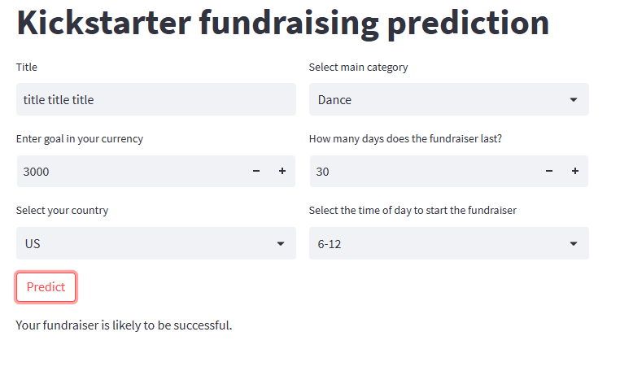

# Will the Kickstarter fundraiser be successful?
The project was created while learning Machine Learning. Includes classification issues. Based on the collected data on fundraising on the Kickstarter platform, a model was created that predicts the success or failure of a fundraiser. The notebook includes data visualization, pre-processing and creating and saving a finall model. The application was developed using Streamlit. Basic data about the fundraising must be provided to the application, and then a prediction of success or failure will be returned. The entire model and the application have been written in such a way that it is possible to check it's success even before publishing the fundraiser.

## Kickstarter app - example

## Next step
In the future, the selection of hyperparameters for the created Random Forest model should be made.
