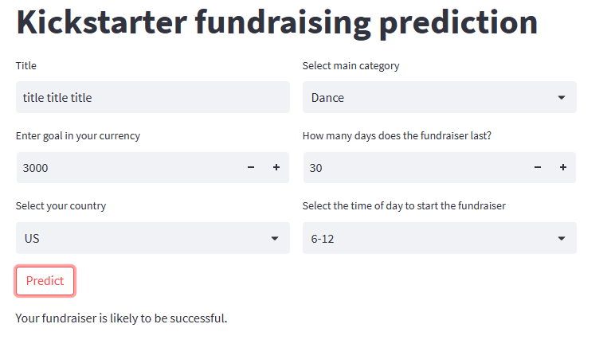

# Will the Kickstarter fundraiser be successful?
The project was created while learning Machine Learning during Data Science Bootcamp. Includes classification issues. Based on the collected data on fundraising on the Kickstarter platform, a model was created that predicts the success or failure of a fundraiser. The notebook includes data visualization, pre-processing and creating and saving a finall model. The application was developed using Streamlit. Basic data about the fundraising must be provided to the application, and then a prediction of success or failure will be returned. The entire model and the application have been written in such a way that it is possible to check it's success even before publishing the fundraiser.

## The repository contains:
* app.py - contains app
* kickstarter_en.ipynb -contains data processeing, visualization, modelling
* kickstarter_model.ypunb -contains only building final model. If you do not want to download app.py, here you can check online how the final model works
* photo1.png
* photo2.png
* requirements.txt 

## How to Install and Run the app.py
1. Download the app.py and requirements.txt files.
2. Install the libraries listed in the requirements.txt file. You can use the following command in your terminal or command prompt:
`pip install -r requirements.txt`
3. Open the app.py file, for example, using PyCharm or any other Python editor of your choice.
4. Once the file is open, the application will start downloading the necessary data and training the model. This initial setup may take up to approximately 30 minutes to complete.
5. After the initial setup, the application will display predictions on the success or failure of fundraising campaigns based on the trained model. Subsequent openings of the application will not require re-downloading the dataset or retraining the model, as it will use the previously generated model.
6. Run the app.py file to start the application.
7. The application, built using Streamlit, will open in your default web browser and display the predicted results.

Please note that the instructions assume you have Python and pip already installed on your system. If not, make sure to install them before proceeding with the steps above.

## Kickstarter app - example

## Next step
In the future, the selection of hyperparameters for the created Random Forest model should be made.
